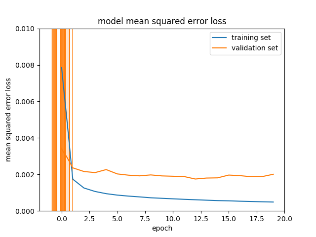
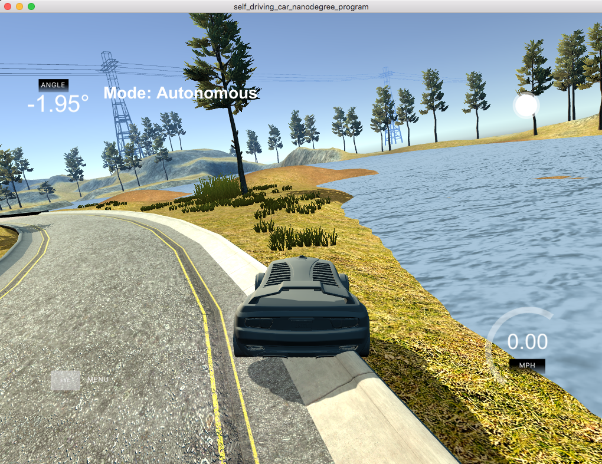
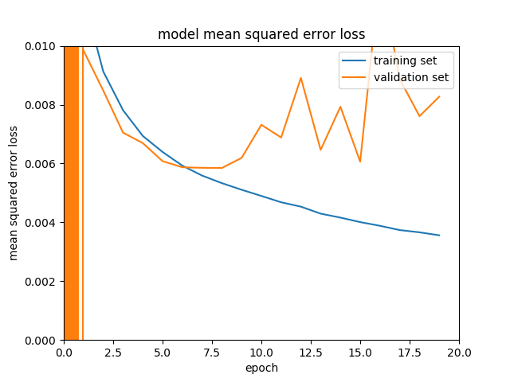
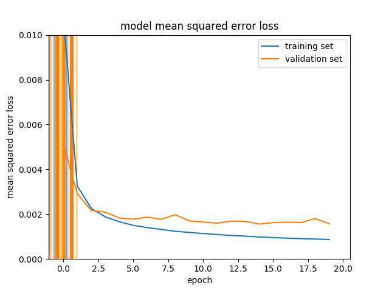
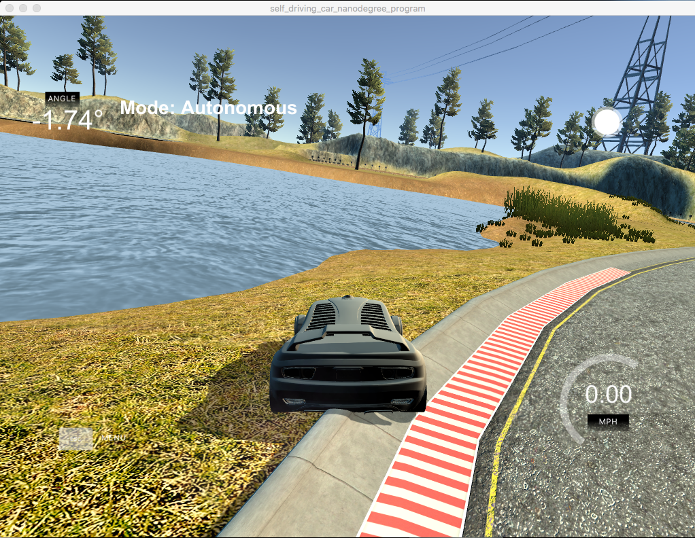
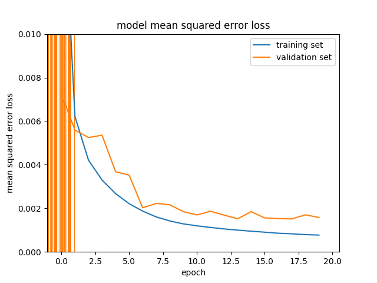

# **Behavioral Cloning** 

## Rubric Points
### Here I will consider the [rubric points](https://review.udacity.com/#!/rubrics/432/view) individually and describe how I addressed each point in my implementation.  

---
### Required Files

#### 1. Are all required files submitted?: The submission includes a model.py file, drive.py, model.h5 a writeup report and video.mp4.

My project includes the following files:
* model.py containing the script to create and train the model
* drive.py for driving the car in autonomous mode
* model.h5 containing a trained convolution neural network 
* writeup_report.md or writeup_report.pdf summarizing the results

### Quality of Code

#### 1. Is the code functional?: The model provided can be used to successfully operate the simulation. 

Using the Udacity provided simulator and my drive.py file, the car can be driven autonomously around the track by executing 
```
python drive.py model.h5
```

#### 2. Is the code usable and readable?: The code in model.py uses a Python generator, if needed, to generate data for training rather than storing the training data in memory. The model.py code is clearly organized and comments are included where needed.

The model.py file contains the code for training and saving the convolution neural network. The file shows the pipeline I used for training and validating the model, and it contains comments to explain how the code works.

### Model Architecture and Training Strategy

#### 1. Has an appropriate model architecture been employed for the task?: The neural network uses convolution layers with appropriate filter sizes. Layers exist to introduce nonlinearity into the model. The data is normalized in the model.

I used the modified [comma.ai model](https://github.com/commaai/research/blob/master/train_steering_model.py) (see below for the detailed architechture). The data is normalized in the model using a Keras lambda layer (model.py line 145). It contans three convolutional layers (model.py lines 146-148). The model includes ELU layers to introduce nonlinearity. 

#### 2. Has an attempt been made to reduce overfitting of the model?: Train/validation/test splits have been used, and the model uses dropout layers or other methods to reduce overfitting.

The model contains dropout layers in order to reduce overfitting (model.py lines 150 and 153). 

The data was split into the training set (80%) and the test set (20%) (model.py line 109). The model was trained and validated on different data sets to ensure that the model was not overfitting. The model was tested by running it through the simulator and ensuring that the vehicle could stay on the track.

#### 3. Have the model parameters been tuned appropriately?: Learning rate parameters are chosen with explanation, or an Adam optimizer is used. 

The model used an adam optimizer (model.py line 158). The initial learning rate was set at 0.001, and after several iterations, the learning rate at 0.0001 provided consistently declining loss.

#### 4. Is the training data chosen appropriately?: Training data has been chosen to induce the desired behavior in the simulation (i.e. keeping the car on the track).

Training data was chosen to keep the vehicle driving on the road. I used a combination of sample data provided by Udacity, and recovery laps from the left and right sides of the road.

For details about how I created the training data, see the next section. 

### Architecture and Training Documentation

#### 1. Is the solution design documented?: The README thoroughly discusses the approach taken for deriving and designing a model architecture fit for solving the given problem.

##### A. Introduction
My first step was to use the [NVIDIA model](https://images.nvidia.com/content/tegra/automotive/images/2016/solutions/pdf/end-to-end-dl-using-px.pdf) as suggested by the lecture. I created a simple initial model without generator or visualization. The initial model did not perform well. The mean square error remained high at 0.09 at best. To improve model trainining, I hired three additional test drivers (my wife, a son and a daughter) to drive additional laps to increase the sample size >40K as suggested by [Paul Heraty](https://carnd-forums.udacity.com/cq/viewquestion.action?id=26214464&questionTitle=behavioral-cloning-cheatsheet). 

At this point, unfortunately my GPU box went out of order. My GPU box has two NVIDIA Tesla K80 cards with a liquid cooling system, but it overheated and became unresponsive due to cooling oil leaks (it's on its way to the manufacturer). This significantly delayed the further model building process, since I am now left with my iMac (32GB RAM) at work and MacBookAir (8GB RAM) without GPU. I ended up spending a long time trying to install the GPU version of tensorflow in OSX and failed to make it work. Apparently this is not uncommon among the community since I saw so many frustrated comments in Github and Stack Overflow. I continued to improve the NVIDIA model, although slowly, using the CPU version of tensorflow on OSX. Finally the car stopped moving in the autonomous mode. I was not sure whether the cause was the preprocessing, model architechtecture, etc. 

Since each training took a significantly long time with the NVIDIA model, I decided to switch to the [comma.ai model](https://github.com/commaai/research/blob/master/train_steering_model.py) which has a simpler structure, hoping that it will expedite the iteration process. However, it turns out that the comma.ai model does not run on my MacBookAir (8GB RAM) likely because it has much higher number of parameters (which I was not aware of initially). Therefore, I continued my work using my iMac (32GB RAM) at work. I decided to use only the sample data provided by udacity due to a memory concern. By the way, recent upgrade of Keras to version 2 added to my confusion as to debugging due to changes in grammer between version 1 (used in lectures) and version 2.

##### B. Model 1
I used the unmodified comma.ai model. I introduced the generator an visualization scheme as suggested by the lecture. I used the batch size of 32 due to a memory concern, and the epoch number of 20.  


The error of the training set was below 0.001, which is not bad, but the error of the validation set was significantly higher (>0.002). This indcates overfitting. In the autonomous mode, the car could not successfuly turn the first steep left curve.


##### C. Model 2
To combat the overfitting, I made three modifications. 
1) I increased the dropout rate of the first dropout layer from 0.2 to 0.5.
2) I added a new dropout layer with a dropout rate of 0.5 immediately before the last fully connected layer.
3) I added a new two-dimensional (2-D) spatial dropout layer with a dropout rate of 0.2 after each of three convolutional layers [model.add(SpatialDropout2D(0.2)]


The model performed much worse. The error of the training set was now >0.004, and the error of the validation set was even worse. It was also concerning that the error of validation set kept rising over epochs. Obviously this approach was not working.

##### D. Model 3
I removed the dropout layer before the last fully connected layer, and all of the 2-D spatial dropout layers. Therefore, essentially the only modification from the original comma.ai model was that the dropout rate of the first dropout layer was 0.5 instead of 0.2.


The model performed better. The training error slightly increased (~0.001), but the validation error slightly decreased (~0.002) from the original comma.ai model. Overall, the difference between the training and validation error decreased, indicating that the overfitting improved.


However, in the autonomous mode, the car could not successfuly turn the first steep right curve and went into the water. Obviously it needs to learn recovery laps. At this point I was using only the sameple data sets provided by udacity, although I was using center, left and right camera images.

##### E. Model 4
All along my struggles with the project, my udacity mentor Eren Aydemir have made a number of excellent suggestions. One of them was regarding recovery laps. Instead of recording only the recoveries, he suggested driving on the yellow lane for one full lap, left and right, and add a counter-steering angle during preprocessing. This worked very well.


Both the training and the validation errors were not substantially different with or without the recovery laps. Most importantly, in the autonomous mode the car successfully ran for laps after laps in track 1 without going out of the road.


#### 2. Is the model architecture documented?: The README provides sufficient details of the characteristics and qualities of the architecture, such as the type of model used, the number of layers, the size of each layer. Visualizations emphasizing particular qualities of the architecture are encouraged.

The final model architecture (model.py lines 140-157) consisted of a convolution neural network with the following layers and layer sizes:

| Layer (type)        		|     Output Shape 	        					| Parameter # |
|:---------------------:|:---------------------------------------------:| 
| Cropping         		| (None, 65, 320, 3)    							| 0|
| Lambda - Resizing     	| (None, 40, 160, 3)  	| 0 |
| Lambda - Normalization					|		(None, 40, 160, 3)			| 0|
| 2-D Convolution	      	| (None, 10, 40, 16) 				|3,088 |
| 2-D Convolution    |  (None, 5, 20, 32)   	| 12,382 |
| 2-D Convolution		|  (None, 3, 10, 64)     			|51,264|
| Flatten	| (None, 1,920)         									| 0|
|	Dropout		|	(None, 1,920)									| 0|
|	ELU	|	(None, 1920)   		|0|
| Dense		|        (None, 512) 									| 983,552|
|	Dropout		|	 (None, 512) 							|0|
|	ELU 		|	(None, 512) 					|0|
|	Dense		|	(None, 50) 						|25,650|
|	ELU		|	(None, 50) 					|0|
| Dense		|  (None, 1)      		|51|


Total params: 1,076,437.0


Here is a visualization of the architecture (note: visualizing the architecture is optional according to the project rubric)

![alt text][image1]

#### 3. Is the creation of the training dataset and training process documented?: The README describes how the model was trained and what the characteristics of the dataset are. Information such as how the dataset was generated and examples of images from the dataset should be included.

To capture good driving behavior, I first recorded two laps on track one using center lane driving. Here is an example image of center lane driving:

![alt text][image2]

I then recorded the vehicle recovering from the left side and right sides of the road back to center so that the vehicle would learn to .... These images show what a recovery looks like starting from ... :

![alt text][image3]
![alt text][image4]
![alt text][image5]

Then I repeated this process on track two in order to get more data points.

To augment the data sat, I also flipped images and angles thinking that this would ... For example, here is an image that has then been flipped:

![alt text][image6]
![alt text][image7]

Etc ....

After the collection process, I had X number of data points. I then preprocessed this data by ...


I finally randomly shuffled the data set and put Y% of the data into a validation set. 

I used this training data for training the model. The validation set helped determine if the model was over or under fitting. The ideal number of epochs was Z as evidenced by ... I used an adam optimizer so that manually training the learning rate wasn't necessary.

### Simulation

#### 1. Is the car able to navigate correctly on test data?: No tire may leave the drivable portion of the track surface. The car may not pop up onto ledges or roll over any surfaces that would otherwise be considered unsafe (if humans were in the vehicle).


Optional:

Suggestions to Make Your Project Stand Out!
Track Two

The simulator contains two tracks. To meet specifications, the car must successfully drive around track one. Track two is more difficult. See if you can get the car to stay on the road for track two as well.

REFERENCES:

1. 

2. Bojarski et al., End to End Learning for Self-Driving Cars. https://arxiv.org/abs/1604.07316
